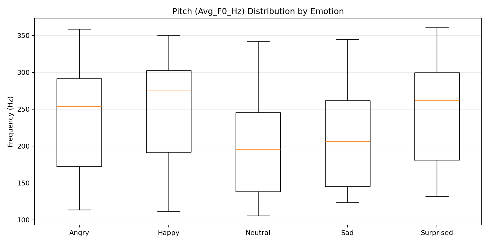
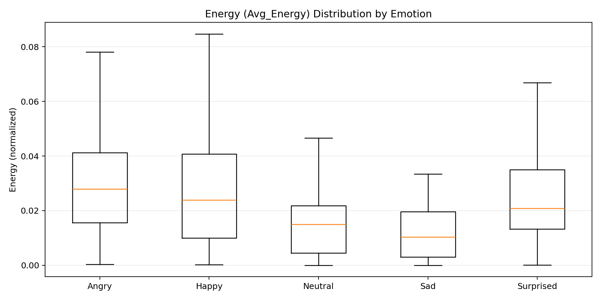
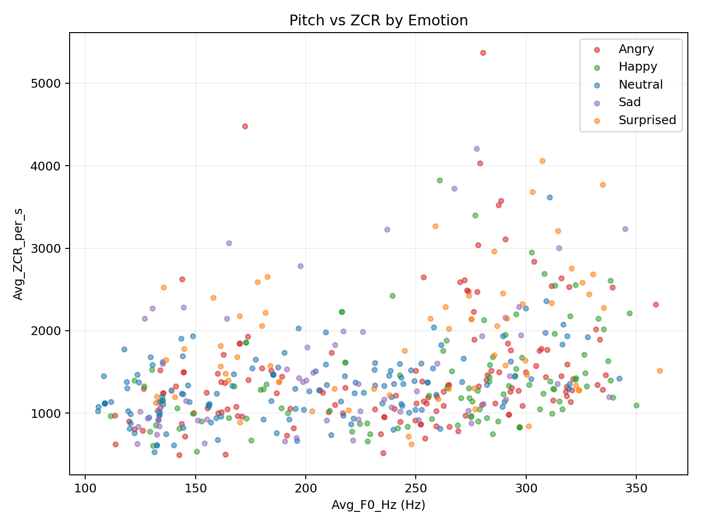

# Final Project - Phase 1 Technical Report (Group 17)

## 1) Introduction
This report presents the first working baseline model for automatic speech emotion classification in the `BIL216 Signals and Systems` final project.  
Target classes are `Neutral`, `Happy`, `Angry`, `Sad`, and `Surprised`.  
The Phase-1 goal is to submit a complete end-to-end pipeline and enter the scoreboard with a reproducible baseline accuracy.

## 2) Dataset Characterization
The merged metadata and audio set used in this phase contains:

- Total records: **613**
- Audio files found: **613**
- Missing audio files: **0**
- Age range: **4 - 87**
- Mean age: **22.44**

Gender distribution:

- Male: **215**
- Female: **211**
- Child: **187**

Emotion distribution (normalized labels):

- Angry: **160**
- Happy: **132**
- Neutral: **155**
- Sad: **82**
- Surprised: **84**

## 3) Methodology
The baseline workflow is fully Python-based and implemented in scripts under `src/`.

### 3.1 Data Preparation
- Group metadata files are merged into a master sheet (`data/master_metadata.xlsx`).
- File-level label text is normalized (Turkish/English variants mapped into the 5 target emotions).
- Audio existence and path consistency are validated.

### 3.2 Feature Extraction
For each `.wav` file, frame-based analysis is performed and the following features are computed:

- `Avg_F0_Hz` (pitch)
- `Avg_ZCR_per_s` (zero crossing rate)
- `Avg_Energy` (short-term energy)
- `Voiced_Frame_Ratio`
- `Spectral_Centroid_Mean`
- `Spectral_Bandwidth_Mean`
- `Spectral_Rolloff_Mean`
- `Spectral_Flatness_Mean`
- (Additional MFCC features are extracted in the pipeline, but the selected baseline model uses the feature subset listed in outputs.)

### 3.3 Model Selection
For Phase 1, we used:

- **Gradient Boosting Classifier** (`gradient_boosting_audio_only`)
- Train/test split: **75% / 25%**
- Stratified split and fixed random seed for reproducibility
- Missing numeric values handled via median imputation in a pipeline

Rationale for choosing this model in Phase 1:
- Works well on tabular handcrafted acoustic features
- Fast to train and iterate
- Provides a solid baseline before trying more complex alternatives in Phase 2

## 4) Statistical Findings and Results
Baseline evaluation output:

- Train samples: **452**
- Test samples: **151**
- Overall accuracy: **43.05%**

Per-class metrics (test set):

- Angry: Precision 0.42, Recall 0.41, F1 0.42
- Happy: Precision 0.54, Recall 0.42, F1 0.47
- Neutral: Precision 0.44, Recall 0.78, F1 0.56
- Sad: Precision 0.00, Recall 0.00, F1 0.00
- Surprised: Precision 0.30, Recall 0.17, F1 0.21

Observed confusion matrix behavior:

- `Neutral` is over-predicted and absorbs many samples from other classes.
- `Sad` is frequently confused with `Neutral`.
- `Surprised` and `Angry` overlap in several cases.

### 4.1 Visualization of Feature Sets by Emotion
To satisfy the "visualizing several sets of attributes for different emotional states" requirement, we generated the following feature-distribution plots:

1. Pitch distribution (`Avg_F0_Hz`) by emotion  

2. Energy distribution (`Avg_Energy`) by emotion  

3. Joint distribution of Pitch and ZCR (`Avg_F0_Hz` vs `Avg_ZCR_per_s`)  

Short interpretation:
- `Neutral` and `Sad` clusters partially overlap in both pitch and ZCR space, which is consistent with confusion matrix errors.
- `Happy` tends to show relatively higher energy/pitch regions than `Sad`, but class boundaries are not linearly separable.
- `Angry` and `Surprised` have intersecting regions, especially in mid-high ZCR ranges.

> Note: Visualizations were generated from rows with valid mapped emotion labels and valid numeric feature values.

## 5) Error Analysis and Discussion
Main reasons for incorrect predictions in this baseline:

1. **Class overlap in handcrafted features**: Similar pitch/energy profiles across some emotions reduce separability.
2. **Imbalance and intra-class variability**: `Sad` and `Surprised` have fewer samples and broader speaker variation.
3. **Recording/environment variability**: Background noise, microphone differences, and speech style increase feature variance.
4. **Temporal information loss**: Mean-based summary features do not capture dynamic emotional contours sufficiently.

Planned improvements for Phase 2:

- Add richer spectral and statistical descriptors (variance, percentiles, kurtosis, skewness).
- Use MFCC delta and delta-delta features explicitly in model selection experiments.
- Evaluate additional models (e.g., SVM, Random Forest, XGBoost) and tune hyperparameters.
- Apply class-balancing strategies and cross-validation.
- Perform systematic feature importance and ablation studies.

## 6) Classification Success (Scoreboard Entry)
Phase-1 submitted score:

- Group: **17**
- Method: **Gradient Boosting**
- Accuracy: **43.05%**
- Features: **Pitch (F0), ZCR, Energy, Voiced Ratio, Spectral Features, MFCC set**

Scoreboard link:  
<https://bil216finalproje-woau7utnbhu7q6hbz8nuff.streamlit.app/>

## 7) GitHub Link
Project repository link: **[TO_BE_FILLED_BY_TEAM]**

## 8) Resources
Resources/tools used in this phase:

- Python ecosystem: `pandas`, `numpy`, `scikit-learn`, `scipy`, `librosa`, `joblib`
- Course-provided project instructions and rubric
- Suggested external sources in assignment brief (Google Scholar, GitHub/Kaggle examples)
- AI assistance for code review, debugging, and report drafting

## 9) Prompts (AI Usage Table)
| Purpose | Example Prompt |
|---|---|
| Model tracking | "Current emotion model accuracy kaç?" |
| Method selection | "CNN-LSTM, Transformer, ResNet, XGBoost, Gradient Boosting... hangisini kullandık?" |
| Reporting | "Mayıs 5 istenenlere göre Phase-1 raporu hazırlayalım." |

## 10) Team Member Contributions
- **Member 1**: Metadata cleaning/merging pipeline and data validation.
- **Member 2**: Acoustic feature extraction and preprocessing scripts.
- **Member 3**: Model training/evaluation, confusion matrix and metric analysis.
- **Member 4**: Report writing, scoreboard entry, and demo preparation.

> Note: Replace member placeholders with real names and exact task splits before submission.

